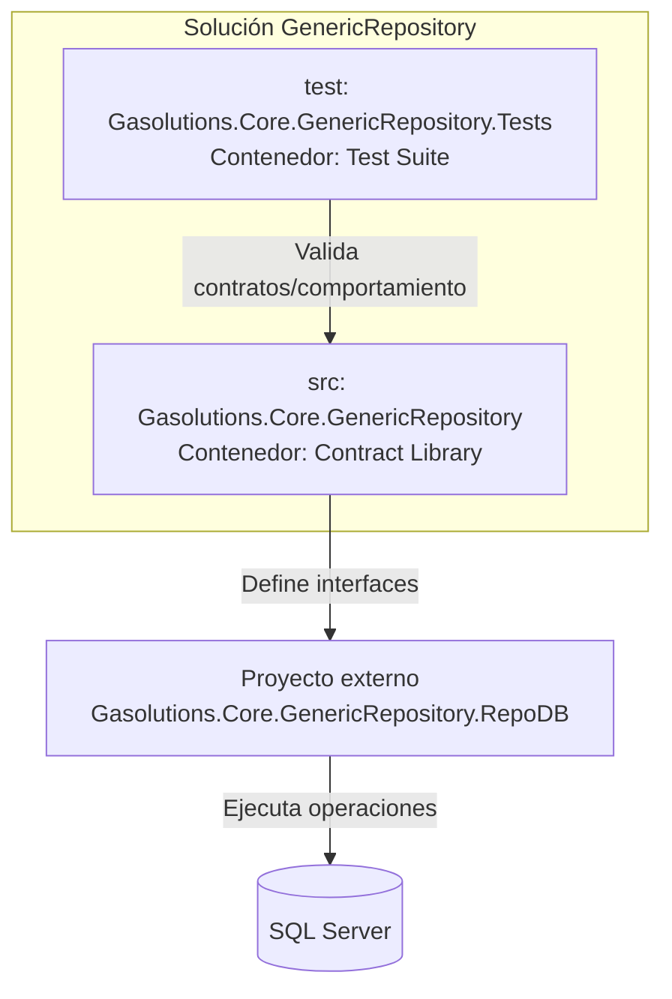

# Project Architecture Blueprint

## Metadatos
- **Proyecto analizado**: `Gasolutions.Core.GenericRepository`
- **Nivel**: **Comprehensive**
- **Fecha de generación**: 2026-03-15
- **Tipo de solución**: Biblioteca de contratos + proyecto de pruebas
- **Framework objetivo**: `.NET 9 (net9.0)`
- **Patrón arquitectónico detectado**: **Layered / Contract-First Repository Pattern**
- **Tipo de diagrama solicitado**: **C4**

---

## 1) Detección de arquitectura y stack

### Stack detectado
- **Plataforma**: .NET 9
- **Lenguaje**: C# (LangVersion 13.0)
- **Modelo principal**: Librería de interfaces para repositorio genérico
- **Acceso a datos (contratos orientados a)**:
  - `RepoDb.SqlServer`
  - `Microsoft.Data.SqlClient`
- **Testing**:
  - xUnit
  - Moq
  - Coverlet

### Estructura de solución detectada
- `src/Gasolutions.Core.GenericRepository.csproj`
  - Contratos e interfaces del repositorio genérico
- `test/Gasolutions.Core.GenericRepository.Tests.csproj`
  - Proyecto de pruebas (sin casos de prueba incluidos actualmente en la solución abierta)

### Hallazgo clave de evolución
Según `src/CHANGELOG.md`, las **implementaciones** fueron movidas a un proyecto separado:
- `Gasolutions.Core.GenericRepository.RepoDB`

Esto confirma una separación explícita entre:
1. **Contrato (este repositorio/paquete)**
2. **Implementación concreta (proyecto externo RepoDB)**

---

## 2) Visión arquitectónica general

La arquitectura actual prioriza una estrategia **contract-first**:
- La librería publica interfaces (`IReadGenericRepository`, `IReadGenericRepository<T,TKey>`, `IWriteGenericRepository<T,TKey>`).
- La lógica concreta de persistencia se desacopla y evoluciona en un proyecto de implementación independiente.
- El consumo en capas de aplicación/dominio se hace por abstracciones, facilitando DI, pruebas y sustitución de proveedor de datos.

### Principios evidentes
- **Inversión de dependencias**: consumidores dependen de interfaces.
- **Separación de responsabilidades**:
  - Lectura y escritura separadas.
  - Contrato separado de implementación.
- **Extensibilidad por composición**: nuevas implementaciones pueden respetar los mismos contratos.

---

## 3) Diagramas C4

### C4 - Nivel 1 (Contexto)

```mermaid
flowchart LR
    U[Aplicación Consumidora\n(API/Worker/Web)] --> C[Paquete de Contratos\nGasolutions.Core.GenericRepository]
    C --> I[Implementación Concreta\nGasolutions.Core.GenericRepository.RepoDB]
    I --> DB[(SQL Server)]
```

### C4 - Nivel 2 (Contenedores)



### C4 - Nivel 3 (Componentes del contenedor de contratos)

```mermaid
flowchart LR
    A[IReadGenericRepository\n(consulta ad-hoc JSON)]
    B[IReadGenericRepository<T,TKey>\n(lectura tipada)]
    C[IWriteGenericRepository<T,TKey>\n(escritura y comandos)]
    G[GlobalUsings\n(RepoDb/SqlClient/System.Data)]

    G --> A
    G --> B
    G --> C
```

---

## 4) Componentes arquitectónicos centrales

## 4.1 `IReadGenericRepository`
**Propósito**: contrato de consulta genérica que retorna JSON para escenarios no tipados o dinámicos.

**Responsabilidad principal**:
- Exponer `QueryAndReturnJson(commandText, commandType)`.

**Interacción**:
- Consumido por servicios que requieren flexibilidad de shape de datos.
- Implementado externamente por la librería RepoDB.

## 4.2 `IReadGenericRepository<T, TKey>`
**Propósito**: lectura tipada con criterios, ordenamiento, conteo, caché y agregación (`Max`).

**Responsabilidad principal**:
- Consultas orientadas a entidad.
- Operaciones de lectura y análisis básico.

**Patrones usados**:
- Generic Repository
- Query by criteria (`whereOrPrimaryKey`)

## 4.3 `IWriteGenericRepository<T, TKey>`
**Propósito**: operaciones de escritura y ejecución de comandos SQL (incluye bulk insert y variantes transaccionales).

**Responsabilidad principal**:
- Insert/Update/Delete/Merge/Bulk
- Ejecución de comandos (`ExecuteNonQuery`, `ExecuteScalar`, `ExecuteReader`, `ExecuteQuery`)

**Patrones usados**:
- Command-style data access
- Transaction-aware overloads

---

## 5) Capas y dependencias

### Capas inferidas
1. **Capa de contratos** (actual solución principal)
2. **Capa de implementación de infraestructura** (proyecto externo RepoDB)
3. **Capa de consumidor de aplicación** (fuera de esta solución)

### Reglas de dependencia
- Consumidores → contratos ✅
- Implementación → contratos ✅
- Contratos → implementación ❌ (no permitido)

### Hallazgos
- La separación de capas está bien marcada por el split a `GenericRepository.RepoDB`.
- No se detectan dependencias circulares en la solución abierta.

---

## 6) Arquitectura de datos

### Modelo de datos
- Esta solución no define entidades concretas.
- El contrato usa genéricos (`T`, `TKey`) para adaptarse a múltiples dominios.

### Patrón de acceso
- Repositorio genérico
- Soporte para:
  - criteria object / primary key
  - ordenamiento con `OrderField`
  - operaciones bulk con `BulkInsertMapItem`

### Transformación y formato
- Dos enfoques soportados:
  1. Tipado (`IEnumerable<T>`)
  2. JSON (`string`)

---

## 7) Cross-cutting concerns (estado real)

### Seguridad (authn/authz)
- No implementada en este paquete (por tratarse de contratos).
- Debe resolverse en aplicación/infraestructura concreta.

### Manejo de errores y resiliencia
- El contrato documenta excepciones para operaciones fallidas.
- Retries/circuit breaker no están en esta capa; deben estar en implementación.

### Logging y observabilidad
- No hay logging en contratos (esperado).
- Recomendado: instrumentar en implementación (RepoDB) y capa de aplicación.

### Validación
- No hay validación concreta en interfaces.
- Recomendado: validaciones de argumentos y reglas de negocio en capas consumidoras e implementación.

### Configuración
- No contiene providers de configuración.
- El manejo de connection string y secretos pertenece a host/infra.

---

## 8) Patrones de comunicación de servicios

- Comunicación principal: **invocación síncrona en proceso** mediante interfaces C#.
- Frontera de servicios: `IRead*` y `IWrite*` como puertos de acceso a persistencia.
- Protocolo hacia DB: delegado a implementación RepoDB/SqlClient.
- Versionado de API: controlado por versionado de paquete NuGet (`AssemblyVersion` / `Version`).

---

## 9) Patrones .NET específicos

- **Class Library .NET 9** con `ImplicitUsings` y `Nullable` habilitados.
- **Global Usings** para centralizar dependencias técnicas (`System.Data`, `RepoDb`, `SqlClient`).
- **XML Documentation** habilitada para generar documentación de API.
- **Empaquetado NuGet** con `GeneratePackageOnBuild`.
- **Release notes automáticas** leyendo `CHANGELOG.md` en el target MSBuild `ReadPackageReleaseNotes`.

---

## 10) Patrones de implementación (guía)

## 10.1 Diseño de interfaces
- Mantener interfaces pequeñas por responsabilidad:
  - lectura dinámica
  - lectura tipada
  - escritura
- Preferir sobrecargas transaccionales donde aplique.

## 10.2 Patrón de implementación recomendado
- Proyecto `*.RepoDB` implementa interfaces del paquete de contratos.
- Registro DI por interfaces públicas.
- Encapsular `SqlConnection` y transacciones en infraestructura.

## 10.3 Plantilla sugerida de clase de implementación

```csharp
public sealed class WriteGenericRepository<T, TKey> : IWriteGenericRepository<T, TKey>
    where T : class
    where TKey : struct
{
    public TKey Insert(T entity)
    {
        // Implementación concreta en infraestructura RepoDB
        throw new NotImplementedException();
    }

    // ...resto de métodos del contrato
}
```

---

## 11) Arquitectura de pruebas

### Estado detectado
- Existe proyecto de pruebas con referencias a xUnit, Moq y Test SDK.
- No se detectaron archivos de prueba concretos dentro de la solución actual abierta.

### Estrategia recomendada
- **Unit tests** por contrato/adapter.
- **Integration tests** contra SQL Server (ambiente controlado).
- Mocking de dependencias de conexión/transacción cuando sea posible.

---

## 12) Arquitectura de despliegue

- El artefacto principal de esta solución es un **paquete NuGet**.
- La implementación concreta (RepoDB) se despliega como paquete/librería separada.
- Topología típica:
  1. Aplicación host consume contrato + implementación.
  2. Configuración y secretos en host.
  3. SQL Server como backend.

---

## 13) Extensión y evolución

### Cómo agregar nuevas capacidades
1. Extender primero contrato en `src/Interfaces`.
2. Versionar adecuadamente el paquete.
3. Implementar en `GenericRepository.RepoDB`.
4. Añadir pruebas de compatibilidad en `test`.

### Reglas para preservar integridad
- No introducir dependencias de infraestructura en `src`.
- Evitar cambios breaking en métodos existentes sin estrategia de versionado.
- Mantener XML docs completas para cada API nueva.

---

## 14) Ejemplos de código arquitectónicos

## 14.1 Separación por interfaz (lectura tipada)

```csharp
public interface IReadGenericRepository<T, TKey>
    where T : class
    where TKey : struct
{
    IEnumerable<T> Query(object whereOrPrimaryKey);
    IEnumerable<T> QueryAll();
    TKey? Max(string tableName, string fieldName, object whereOrPrimaryKey);
}
```

## 14.2 Comunicación por contrato (escritura)

```csharp
public interface IWriteGenericRepository<T, TKey>
    where T : class
    where TKey : struct
{
    TKey Insert(T entity);
    int Update(T entity);
    int Delete(object whereOrPrimaryKey);
}
```

## 14.3 Ejemplo de consumo en aplicación

```csharp
public sealed class CustomerService
{
    private readonly IReadGenericRepository<Customer, int> _reader;
    private readonly IWriteGenericRepository<Customer, int> _writer;

    public CustomerService(
        IReadGenericRepository<Customer, int> reader,
        IWriteGenericRepository<Customer, int> writer)
    {
        _reader = reader;
        _writer = writer;
    }

    public IEnumerable<Customer> GetActive() => _reader.Query(new { IsActive = true });
}
```

---

## 15) Registros de decisiones arquitectónicas (ADR resumido)

## ADR-001: Separar contratos de implementaciones
- **Contexto**: necesidad de modularidad y mantenibilidad.
- **Decisión**: mover implementación a `Gasolutions.Core.GenericRepository.RepoDB`.
- **Consecuencia positiva**: menor acoplamiento, mayor capacidad de sustitución.
- **Trade-off**: coordinación adicional de versionado entre paquetes.

## ADR-002: Exponer repositorio genérico por interfaces
- **Contexto**: múltiples dominios y tipos de entidad.
- **Decisión**: contratos genéricos `T, TKey` + operaciones comunes.
- **Consecuencia positiva**: reutilización transversal.
- **Trade-off**: riesgo de abstracción demasiado amplia si no se gobierna.

## ADR-003: Integrar operaciones avanzadas en contrato de escritura
- **Contexto**: requerimientos de rendimiento (bulk insert/merge).
- **Decisión**: incluir métodos especializados en `IWriteGenericRepository`.
- **Consecuencia positiva**: API consistente para operaciones de alto volumen.
- **Trade-off**: el contrato queda influenciado por capacidades del proveedor SQL.

---

## 16) Gobernanza arquitectónica

### Mecanismos detectados
- Versionado de ensamblado/paquete.
- Documentación XML obligatoria.
- Changelog integrado al empaquetado.

### Recomendaciones de compliance
- Validar compatibilidad de contratos en CI con tests de regresión.
- Definir reglas de breaking changes y deprecación semántica.
- Revisar naming de namespaces para consistencia de marca (`GenericRepository` vs `Repository`).

---

## 17) Blueprint para nuevo desarrollo

### Flujo recomendado
1. Definir necesidad funcional de persistencia.
2. Diseñar contrato mínimo en `src/Interfaces`.
3. Documentar XML + changelog.
4. Implementar en proyecto infraestructura (`*.RepoDB`).
5. Registrar DI en aplicación consumidora.
6. Añadir pruebas unitarias/integración.

### Template de organización
- `src/Interfaces/` → contratos públicos
- `src/docs/` → documentación XML
- `test/` → validación de compatibilidad y comportamiento

### Errores comunes a evitar
- Filtrar detalles de SQL/ORM dentro del contrato público.
- Saltarse versionado al introducir cambios breaking.
- Acoplar pruebas a infraestructura no controlada.

---

## Conclusión

La solución implementa una base sólida de **arquitectura por contratos** para repositorios genéricos en .NET 9, con separación explícita de infraestructura y un camino claro para extensibilidad. El split hacia `GenericRepository.RepoDB` fortalece el diseño modular y facilita la evolución controlada del ecosistema.